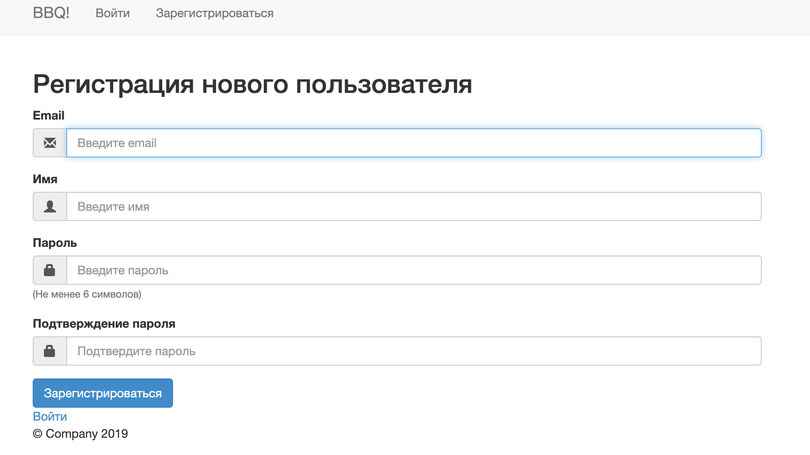
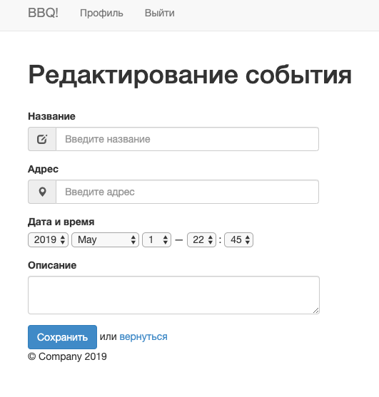
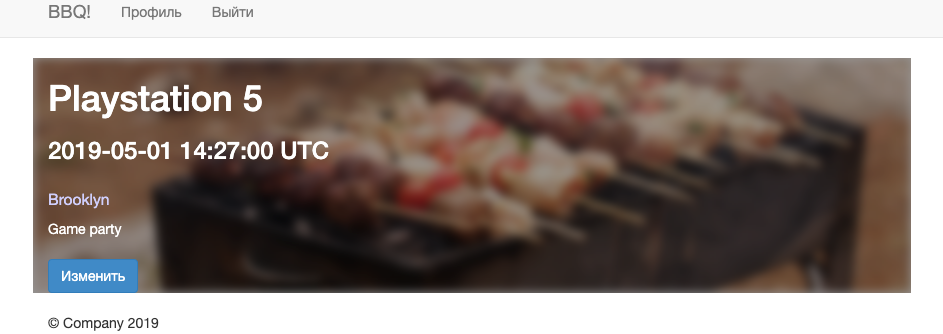

# README

This README document steps are necessary to get the application up and running.

## Precondition 
* Ruby version 2.6.0 installed

## Web Application Stack
* Rails 5.2.3
* Bootstrap 4.0.0
* Postgress 1.1.4

## Description
This application allows to create and review upcoming events. 
* Fill out the following form to create a new user


* Navigate to home page, click on `Создать событие ` and complete the form


* A new event should be displayed on the home page


## Configuration
Install bundler
````
gem install bundler
```` 

To get started with the app, clone the repo and then install the needed gems:
````
bundle install
````

## Database creation and initialization
Next, migrate the database:
````
bundle exec rails db:migrate
````

## Services (job queues, cache servers, search engines, etc.)
Run the app in a local server:
````
bundle exec rails server
````

## Deployment instructions
Following instructions for Heroku:

* Login to your Heroku account
````
heroku login
````
* Create Heroku app
````
heroku create your_app_name
````
* Deploy an application
````
git push heroku master
````
* Initialize database
````
heroku run rails db:migrate
````
* The application should be up and running


